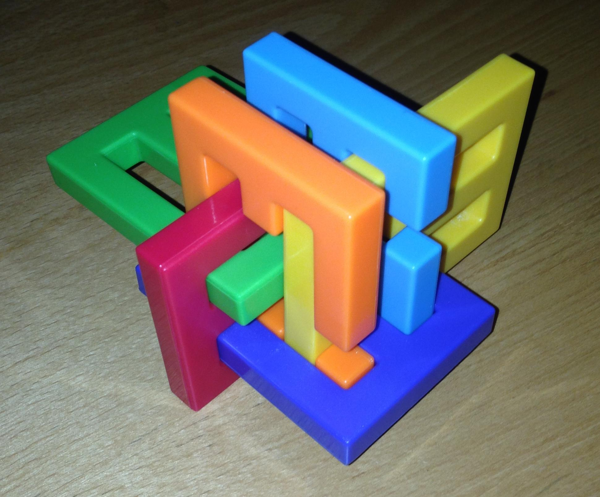

# Controls

- `qweasd`: Translate current piece.
- `p`: Reorient primary axis (cycles the piece X axis through the 6
  cardinal directions)
- `l`: Reorient secondary axis (rotate piece about its X axis, sort of)
- ``TAB```: Change selected piece.
